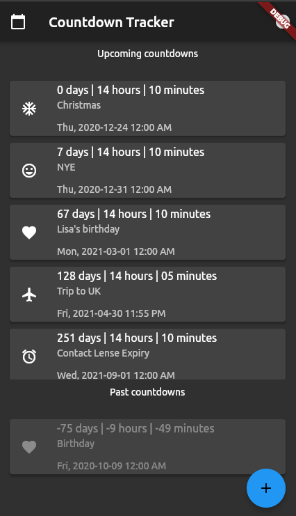
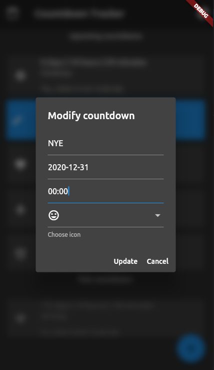

# countdown

A simple countdown tracker app. It allows you to create, modify and delete upcoming and past countdowns.




## Persistence

When creating countdowns, the raw data is persisted on the local system as .json file.

On Linux it is stored in ~/Documents/.countdowns.json.

## How to build it

### On iOS

Open project on your Mac in Xcode and build & run the app on a target device.

### On Linux

Run `flutter build linux`, which will create a `build` directory under the project root.

From there, you can simply run the application by running

```bash
build/linux/release/bundle/countdown
```

Also, you could ship the application to other users by making a zip, like this

```bash
zip -r countdown_release.zip build/linux/release/bundle/
```

## TODOs

* [x] fix ID handling (currently it is just a random int)
* [x] use swiping to delete countdowns
* [x] make datetime picker nicer
* [x] show countdown datetime in subtitle
* [x] allow to edit countdowns
* [ ] allow to chose any icon
* [ ] fix seconds refresh sync (because of ms update is not happening in sync)
* [ ] make color of card dynamic based on how time left
